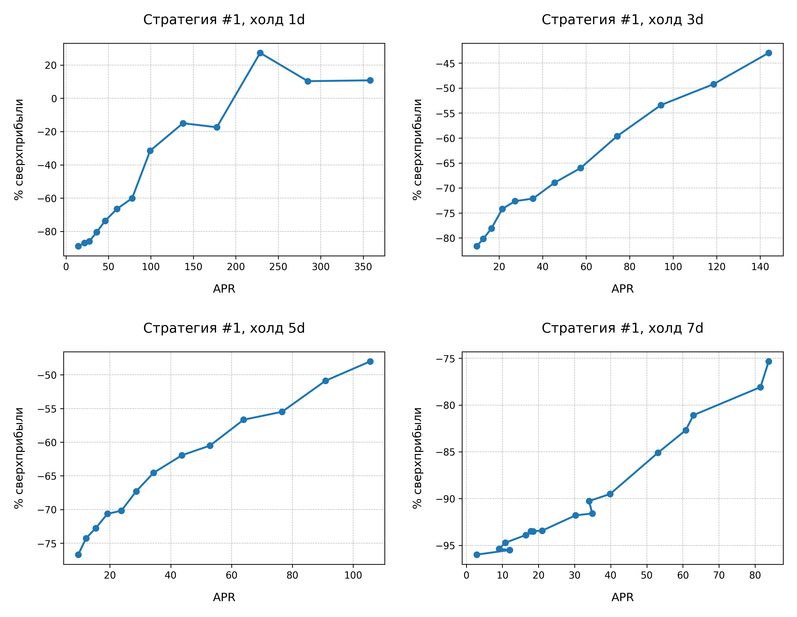
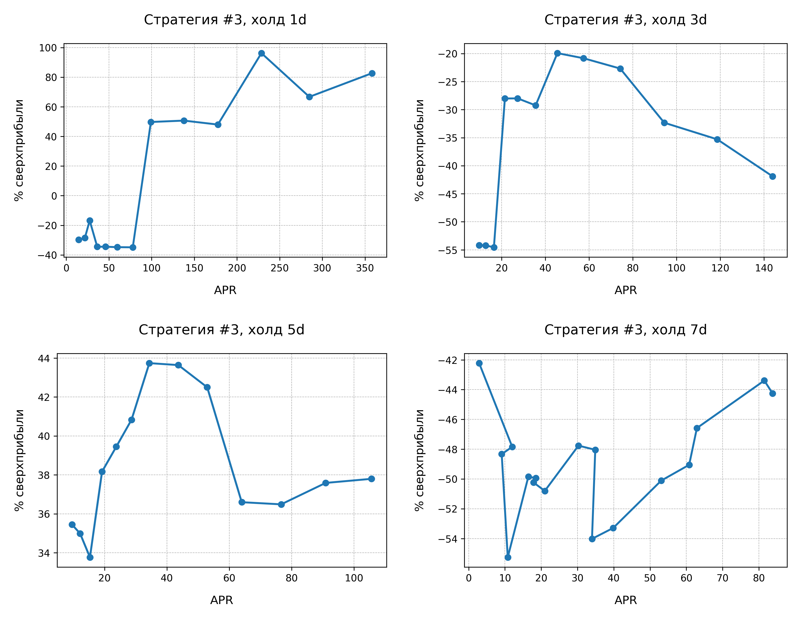
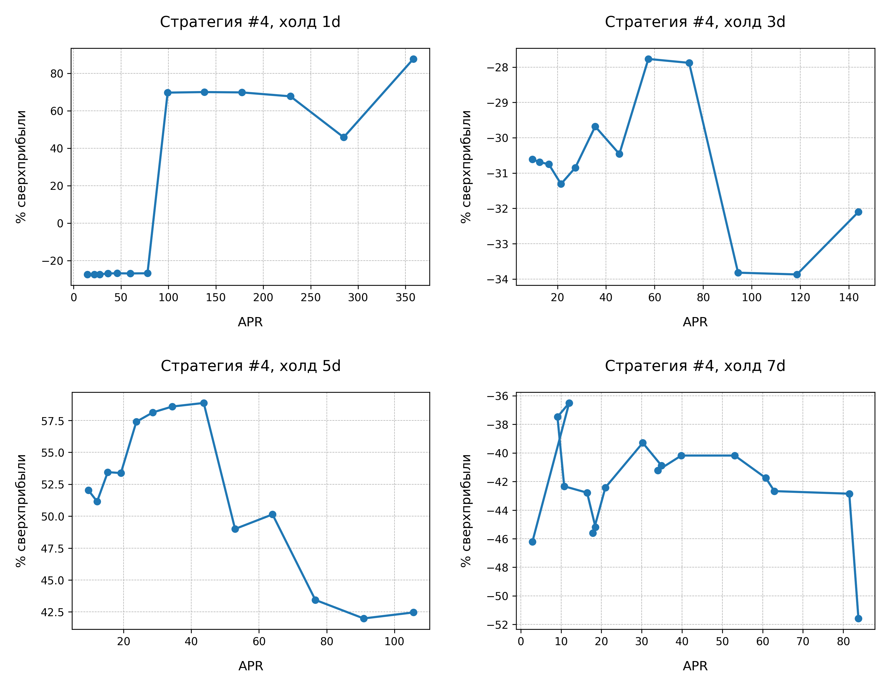
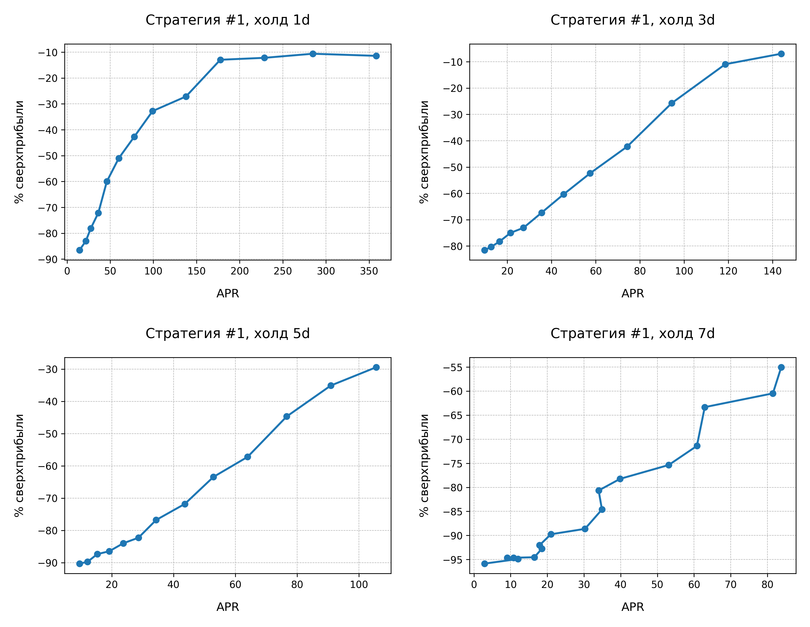
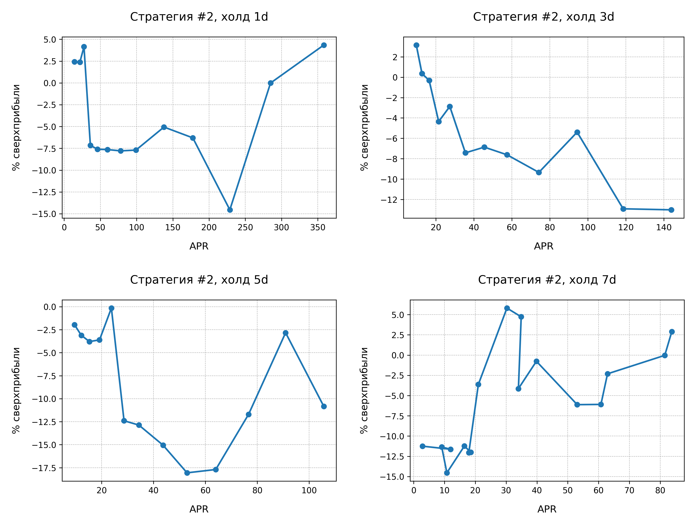

# Введение
Этот репозиторий представляет из себя исследование бивалютных инвестиций в криптовалюту как инструмент повышения доходности для пассивного инвестора

Подробнее о бивалютных инвестициях можно почитать на сайте Bybit: https://www.bybit.com/ru-RU/help-center/article/How-to-View-Dual-Asset-Mining-Orders-on-Bybit. В данной работе мы исследуем продукт **Купить дёшево**.

Мы **не** будем изучать продукт *Продать дорого*, так как для пассивного инвестора главная задача - постоянно покупать активы.  

# Гипотеза

**Цель работы:** исследовать, являются ли бивалютные инвестиции инструментом, позволяющим увеличить доходность портфеля пассивного инвестора

**Гипотеза:** так как бивалютные инвестиции сопровождаются вознограждением с высоким APR в достаточно короткий срок, то <u>получение вознаграждения</u> может сыграть более существенную разницу на длинной дистанции, чем <u>задержка покупки актива</u> на некоторый срок.

**Реализованные задачи:**
* Проработаны 4 стратегии покупки активов через бивалютные инвестиции;
* Собраны цены 5 монет (BTC, ETH, XRP, DASH, LTC) за период 01.12.2015 - 31.03.2021.
* Были построены модели, которые рассчитали возможный доход в прошлом для каждой стратегии.
* Стратегии были проверены на разных сроках бивалютных инвестиций: 1, 3, 5, 7 дней.
* Стратегии были проверены на наборах их 3, 4, 5 монет.
* Были построены графики, сравнивающие различные стратегии, дни и наборы монет
* Была найдена самая прибыльная стратегия.

# Классическая стратегия пассивного инвестирования

* Каждое 1-ое число месяца инвестор будет покупать активы. Каждую монету на 1000$.

# Стратегии с бивалютными инвестициями 

### Общее положение
* Инвестор покупает каждый месяц `n` монет;
* Бюджет в каждый месяц = **n * 1000$**;
* Бюджет на месяц будет распределяться между монетами в зависимости от стратегии;
* `budget` - переменная, обозначающая бюджет на текущую монету;
* `i` - индекс монеты, которую хотим купить;
* **Текущая монета** в контексте стратегии - это `i % n`;
* `days` - то, на какой срок мы отдаём монеты;
* Подробные формулы начисления процентов описаны в первой стратегии.

### Стратегия 1
* budget = 1000$; i = 0
* Ставим budget на достижение целевой цены текущей монеты;
* Если целевая цена **не достигнута**, то:
    * Мы получаем обратно USDT с процентом APR `budget *= 1 + (APR / 365 / 100 * days)`;
    * Переходим к следующей монете по списку `i++`;
    * Возвращаемся к пункту 2.
* Если целевая цена **достигнута**, то:
    * Алгоритм продаёт нам монеты по целевой цене;
    * Алгоритм начисляет проценты на нашу монету `coinCount *= 1 + (APR / 365 / 100 * days)`;
    * Переходим к следующей монете по списку `i++`;
    * Возвращаемся к пункту 1.

### Стратегия 2
* budget = 1000$; i = 0
* Ставим budget на достижение целевой цены текущей монеты;
* Если целевая цена **не достигнута**, то:
    * Мы получаем обратно USDT с процентом APR;
    * Переходим к следующей монете `i++`;
    * На весь budget покупаем **текущую** в списке монету по рыночной цене;
    * Переходим к следующей монете `i++`;
    * Возвращаемся к пункту 1.
* Если целевая цена **достигнута**, то:
    * Алгоритм продаёт нам монеты по целевой цене;
    * Алгоритм начисляет проценты на нашу монету;
    * Переходим к следующей монете по списку `i++`;
    * Возвращаемся к пункту 1.

### Стратегия 3
* budget = 1000$; i = 0
* Ставим budget на достижение целевой цены текущей монеты;
* Если целевая цена **не достигнута**, то:
    * Мы получаем обратно USDT с процентом APR;
    * Переходим к следующей монете;
    * Переносим бюджет с предыдущей монеты на следующую `(budget += 1000$);`
    * Возвращаемся к пункту 2.
* Если целевая цена **достигнута**, то:
    * Алгоритм продаёт нам монеты по целевой цене;
    * Алгоритм начисляет проценты на нашу монету;
    * Переходим к следующей монете по списку;
    * Возвращаемся к пункту 1.

### Стратегия 4
* budget = 1000$;
* Ставим budget на достижение целевой цены текущей монеты;
* Если целевая цена **не достигнута**, то:
    * Мы получаем обратно USDT с процентом APR;
    * Переходим к следующей монете;
    * Переносим бюджет с предыдущей монеты на следующую `(budget += 1000$);`
        * Если это последняя монета, которую мы можем купить в этом месяце - покупаем на все деньги. Затем `budget = 1000$` и `i++`;
    * Возвращаемся к пункту 2;
* Если целевая цена **достигнута**, то:
    * Алгоритм продаёт нам монеты по целевой цене;
    * Алгоритм начисляет проценты на нашу монету;
    * Переходим к следующей монете по списку;
    * Возвращаемся к пункту 1.

# Графики
Графики будут представлены для следующих наборов монет:
* XRP, DASH, BTC, LTC, ETH 
* XRP, DASH, BTC, LTC 
* XRP, DASH, BTC 

Для каждого набора монет будет 4 коллажа, по коллажу для каждой стратегии, на которых будут изображены графики для 4-х возможных холдов (1, 3, 5, 7 дней).

Каждый график - это зависимость **доходности** относительно классической пассивной стратегии **и APR**.

Результаты стратегии классического пассивного инвестирования `passiveResultValue`:
* 5 монет: `13265026.56$`
* 4 монеты: `5381052.94$`
* 3 монеты: `4361318.79$`

Соответственно, именно от этих цифр будет считаться относительная доходности. Т.е. <u>доходность бивалютной стратегии</u> = `(dualAssentResultValue - passiveResultValue) / passiveResultValue * 100`.

В то же время, целевая цена линейно зависит от APR, эту зависимость можно найти в `data/APRs`.

### Набор из 5-ти монет 

#### Стратегия 1

Здесь можно заметить: чем ниже APR, тем меньше доходность. Это обуславливается тем, что на выбранном периоде монеты в основном росли, а значит мы большую часть времени получали обратно USDT с процентами и не покупали монеты.

То есть из-за бурного роста монет инвестор не успевал реализовывать свой капитал, не покупая в какой-то месяц монеты вообще. Это будет прослеживаться и на следующих графиках.

#### Стратегия 2

#### Стратегия 3

#### Стратегия 4

#### Выводы
**Самая доходная стратегия**: #4 с холдом 5 дней, но стратегия #3 с тем же холдом показала неплохой результат.

При этом стоит обратить внимание на холд в 7 дней. При наборе 5-ти монет инвестор не успевает реализовать часть капитала (5 * 7 = 35 дней на реализацию, что больше месяца), поэтому теряет прибыль.

### Набор из 4-х монет

#### Стратегия 1

#### Стратегия 2

#### Стратегия 3

#### Стратегия 4

#### Выводы
**Самая доходная стратегия**: #4 с холдом 1 день. При этом, холд в 7 дней уже не имеет столь плохих результатов, потому что инвестор успевает реализовать капитал.

### Набор из 3-х монет

#### Стратегия 2

#### Стратегия 3

#### Стратегия 4

#### Выводы
**Самая доходная стратегия**: #4 c холдом один день. При этом другие холды в этой же стратегии тоже показали себя неплохо.

# Выводы из расчётов
Самой **успешной** оказалась **стратегия #4**, потому что она является более рискованной (мы покупаем на весь месячный бюджет одну монету). Тем не менее, хоть стратегия #3 является более рискованной, она не приносит успешных результатов из-за очень больших задержек в покупках активов.

Стратегии #1 и #2 показали неудовлетворительный результат, поэтому дальнейшее исследование считаю неэффективным.

Холд в **5 дней** можно назвать **оптимальным** по следующим причинам:
* Позволяет использовать 5 монет в бивалютных инвестициях (видно на графиках)
* Это хоть как-то можно назвать <u>пассивным</u> инвестированием, тогда как 1 или 3 дня холда - это очень частые операции на бирже.

Считаю необходимым провести дополнительные исследования стратегии #4 с холдом в 5 дней на различным набором монет.

# Дополнительное исследование стратегии #4, холд 5d
